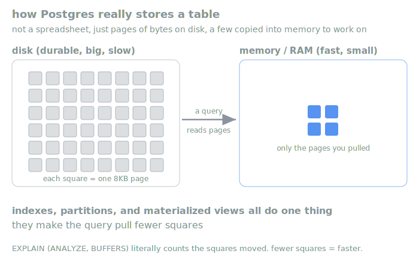
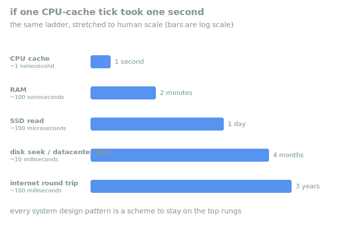

# Module 1, Data Model

The first cumulative layer of the influencer-intelligence pipeline. It's a partitioned
Postgres schema with per-partition indexes, a read-path materialized view, a set of EXPLAIN
drills, and a thin FastAPI surface over the whole thing. Everything past this module (Celery
fan-out, AWS, pgvector, LLM+graph) stacks on top of this data model, so getting the storage
and read/write split right here is the point.

This is interview-prep learning code. The whole value is having run it, broken it, and read
the query plans by hand, so a backend data-modeling round has nothing in it you haven't
already touched.

## What's in it

Four migrations, applied in order, are the source of truth for the schema. Each is raw SQL
with an `up` and a `down` block (dbmate), no ORM, no codegen, so the mechanism stays visible.

- **`20260708000001_initial_schema.sql`** creates the tables. `raw_signals` is RANGE
  partitioned by `captured_at`, the partition key sits inside every unique constraint, and a
  durable `runs` table exists for Module 2 to write job state into.
- **`20260708000002_monthly_partitions.sql`** adds the monthly child partitions (May, June,
  July 2026 to start) and `create_month_partition(date)`, an idempotent function that
  provisions the month containing a given date. The production answer to this is `pg_partman`.
- **`20260708000003_influencer_signals_schema.sql`** reframes the domain from generic
  "competitors" to Defrag's influencer watchlist. It renames `competitors` to `influencers`,
  renames `competitor_id` to `influencer_id` across every table and partition in one ALTER,
  adds `instagram_handle` (the natural scrape key) and `last_scraped_at` (the incremental
  watermark), renames the partition indexes to `*_inf_cap`, and rebuilds the rollup matview.
  All renames, no data dropped.
- **`20260708000004_older_partitions.sql`** backfills partition coverage for Jan through Apr
  2026, so real posts from earlier in the year have somewhere to land. See the pinned-post
  gotcha below for why this was needed.

On top of the schema, `backend/api/` is a thin FastAPI surface. `/influencers` (POST one, or
POST `/influencers/bulk` for the whole watchlist, both upsert on `instagram_handle`; PATCH
advances the watermark), `/sources`, `/signals` (POST is the idempotent `ON CONFLICT` upsert
with a server-derived `content_hash`; GET requires a `from`/`to` window so every read prunes),
and `/rollup` (reads the matview). Real data comes in through the in-repo `scrape-signals`
skill, which drives that API the same way any HTTP client would.

## Why these choices

**RANGE partition by `captured_at`.** The workload is "scrape each creator's posts since the
last scrape" and "show me a creator's signals in a date window." Both carry a time bound, so
partitioning by publish time means every real query prunes to one or two months instead of
scanning a growing firehose. Monthly retention (drop old partitions) also becomes a metadata
operation instead of a mass DELETE.

**The partition key lives inside every unique constraint.** Postgres won't let a unique
constraint on a partitioned table omit the partition key, and there's a deeper reason to want
it there. Uniqueness is enforced per-partition, so `(influencer_id, content_hash, captured_at)`
keeps the idempotency guarantee local to a month's child table and its index.

**Per-partition composite index `(influencer_id, captured_at)`.** Influencer is the equality
predicate, captured_at is the range predicate, so influencer leads. After the planner prunes
to the right month, this index resolves the creator inside it. Every child partition carries
its own copy.

**A materialized view for the read path.** `daily_signal_rollup` precomputes per-creator,
per-day counts. Writes land in `raw_signals`, dashboard reads hit the small rollup, so the
read path never pays for an aggregate over every partition. Its unique index on
`(influencer_id, day)` is what lets the refresh run `CONCURRENTLY` without locking readers.

**Idempotent `INSERT ... ON CONFLICT DO NOTHING`.** At-least-once delivery is assumed
everywhere, so every write is keyed on `(influencer_id, content_hash, captured_at)` and
re-processing the same item twice is a no-op. `content_hash` is derived server-side from the
signal payload, so a re-scrape of the identical post dedupes without the client tracking
anything. That one sentence answers most "what if it runs twice" and "how do you avoid
duplicates" probes.

**An incremental scrape watermark (`last_scraped_at`).** NULL means never scraped, so the
first run pulls only the newest post. After that the scraper pulls posts newer than the
watermark and advances it, so steady-state runs only touch genuinely new content.

**Raw SQL via psycopg, no ORM.** The explicit SQL is the studyable artifact. Partition
pruning, ON CONFLICT, and index usage stay visible in the code and match the raw-SQL migration
choice. A later tag revisits the same endpoints with SQLAlchemy as a deliberate before/after.

## The pinned-post gotcha (worth understanding)

The scraper's "most recent post" means top of the Instagram grid, not newest by date.
Instagram lets a creator pin a post to the top, and a pinned post can be old. rpn's top grid
slot is a pinned 2025-11 post, so the first-run pull (which takes only grid slot 0) grabbed a
post whose month had no partition, and the API correctly 400'd it. The other four creators
don't pin an old post to the top, so their newest-by-grid was also newest-by-date and landed
fine. This is the RANGE partition contract doing exactly its job. A row only inserts if a
partition covers its `captured_at`. Migration 4 provisions the earlier-2026 months so
this-year posts have coverage; pre-2026 pins stay uncovered on purpose.

## The mental model that unifies all of it (pages)

Hold this while running the drills. A table isn't a spreadsheet. On disk it's a pile of
fixed-size 8KB blocks called pages, with rows packed into them. Postgres never reads "a row"
off disk. It reads the whole page the row lives in, into memory, then picks the row out. The
page, not the row, is the atom, and the honest cost of any query is how many pages it had to
haul from disk into memory.



Once you see it that way, everything in Module 1 collapses into one idea.

- A **partition** is "don't even look at pages for months you didn't ask about."
- An **index** is a small separate structure that tells you exactly which pages hold your
  rows, so you skip the rest.
- A **materialized view** is "I already computed this answer and stored it as a few pages,
  so read those instead of aggregating millions."
- The **BUFFERS** number in the EXPLAIN drills is Postgres telling you, out loud, how many
  8KB pages it moved.

When you run the drills, don't read the plans as "is it fast." Read them as "how many pages
did it move, and did my index or partition make that number smaller." Same question, every
time.

Why the page count is the cost that matters. Reading from RAM is on the order of 100
nanoseconds. Reading from an SSD is more like 100 microseconds, roughly a thousand times
slower. So there's a small fast place (memory) and a big slow place (disk), and every
performance question in this module reduces to "how do I answer the query while dragging as
little as possible across that gap."

## The latency ladder (why the gap is the whole game)

Same idea, one level up. Storage isn't fast or slow, it's a ladder of rungs, each ~1000x
slower than the one above. Scaled so one CPU-cache tick is one second:



That single picture is systems engineering. Every pattern you get asked about is a scheme to
stay on the top rungs.

- **Caching** keeps hot stuff on a higher rung.
- **Indexing** spends a little space to skip most of the low-rung reads.
- **CDN** moves the disk closer so the rung is shorter.
- **Batching** carries more per trip when you must go down the ladder.
- **Replication** puts copies on many machines' rungs so no single slow rung blocks everyone.

There's no sixth idea everyone else learned in school. It's this ladder, plus "what if the
machine dies mid-write," which is what idempotency and write-ahead logs answer.

## How to test

Run everything from `backend/` inside the dev container, where Postgres is a sibling at
`db:5432`. Phases 1 to 4 are the core walkthrough. 5 and 6 are optional depth.

### Phase 1, clean database and migrations

```bash
cd backend
make db-empty      # drop the db, re-apply all 4 migrations from empty, seed nothing
make status        # all 4 migrations show as applied, none pending
```

`make db-empty` is the truly-empty path (no rows at all), which is what you want when the
skill is going to add influencers through the API. `make db-fresh` is the same clean re-migrate
but seeds only the watchlist influencers. `make db-init` additionally loads 4000 synthetic
signals for drill volume (you'll want that for Phase 4).

### Phase 2, the API surface

```bash
make api           # uvicorn at :8000, interactive docs at /docs
```

Open `/docs` and exercise the surface. POST `/influencers/bulk` with the watchlist, GET
`/influencers` to read them back, POST a `/signals` twice with the same payload and watch the
second return `inserted: false` (idempotency). GET `/signals` requires a `from`/`to` window,
which is the design point: every read carries the partition key so the planner can prune.

### Phase 3, real data through the scrape skill

With the API still running, from the repo root:

```bash
# seed the watchlist through the API (POST /influencers/bulk)
curl -s -X POST localhost:8000/influencers/bulk \
  -H 'content-type: application/json' \
  -d @.claude/skills/scrape-signals/watchlist.json

# scrape each creator's newest post, incremental off each watermark
uv run --project backend python .claude/skills/scrape-signals/scrape_ig.py

# then fill older partitions: pull the last N posts per creator, ignoring the watermark
uv run --project backend python .claude/skills/scrape-signals/scrape_ig.py --backfill --limit 12
```

The first scrape inserts each creator's newest post and advances the watermark. `--backfill`
looks backward instead of forward, pulls the last N posts regardless of the watermark, and
deliberately does not advance it, so it fills history without disturbing the forward cursor.
Watch the per-creator output. `inserted` counts new rows, `already-had` counts idempotent
no-ops on a re-run, and `skipped` counts posts whose month has no partition. Needs
`APIFY_API_KEY` in `backend/.env` (gitignored).

### Phase 4, the EXPLAIN drills (the SQL nitty-gritty)

This is the core of the module. For the plans to mean something you want volume, so run the
full seed first, then open an interactive psql and paste one block at a time. Don't use
`make drills` for study (it fires the whole file at once and you can't read the plans).

```bash
make db-init                         # schema + 4000 synthetic signals for volume
psql "postgresql://lab:lab@db:5432/sysdesign"
# then paste blocks from backend/drills/explain-drills.sql one at a time
```

The six drills, and what to look for in each plan:

- **(a) Pruned read, the good path.** An `Append` with a single child
  (`raw_signals_2026_07`), the other months absent, and an `Index Scan using
  raw_signals_2026_07_inf_cap` under it. The predicate carries the partition key, so the
  planner prunes to one month, then the composite index resolves the influencer.
- **(b) Same query, no index.** The drill drops the composite index and disables index scans
  for one query so you feel the seq scan cost. Note the subtlety in the comment: dropping only
  the composite index isn't enough, because Postgres falls back to the UNIQUE index (which also
  leads with `influencer_id`). Partitioning still prunes to one month; the index is what
  decides whether you read the bytes. Two independent levers.
- **(c) No partition key in the predicate, the anti-pattern.** An `Append` listing every child
  partition. Filtering on `influencer_id` alone can't prune a table partitioned by
  `captured_at`, so it fans out across all months. Always carry a time bound. After migration 4
  there are more partitions in this fan-out, which makes the anti-pattern more vivid.
- **(d) Index-only scan via a covering index.** `Index Only Scan` and `Heap Fetches: 0` after
  the VACUUM sets the visibility map. When every column the query needs lives in the index,
  Postgres skips the heap entirely. That's what INCLUDE columns buy on a hot read path.
- **(e) Matview vs raw aggregate.** The matview read is an `Index Scan` over a small
  precomputed table. The raw version is an `Append` plus `HashAggregate` over every partition.
  Same answer, wildly different cost. That's the read/write split made visible.
- **(f) Concurrent refresh.** `REFRESH MATERIALIZED VIEW CONCURRENTLY` works only because the
  matview has a unique index on `(influencer_id, day)`. Without CONCURRENTLY the refresh takes
  an ACCESS EXCLUSIVE lock and blocks readers for its duration.

### Phase 5 (optional), partition maintenance

Watch the maintenance mechanism directly. `create_month_partition(date)` is idempotent, so you
can provision a future month by hand and see the child table and its `*_inf_cap` index appear.

```sql
SELECT create_month_partition('2026-09-15');
\d+ raw_signals                       -- the new child is listed
\d raw_signals_2026_09                -- its index came with it
```

In production a scheduled task calls this monthly to stay ahead of incoming data, and a
retention job drops partitions past the window. That's the `pg_partman` pattern, hand-rolled
here so the mechanism is legible.

### Phase 6 (optional), refresh cadence

The rollup is only as fresh as its last refresh. `REFRESH MATERIALIZED VIEW CONCURRENTLY
daily_signal_rollup` after a batch of writes, and re-run drill (e) to confirm the counts moved.
In Module 2 this refresh becomes a Celery task fired after a scrape run completes, which is why
the concurrent-refresh path (and its enabling unique index) matters now rather than later.

## Where this goes next

Module 2 adds the Celery fan-out. The `runs` table already in the schema becomes the durable
job-of-record, Redis carries high-frequency progress, and a Next.js frontend polls it. The
`make openapi` spec (`backend/openapi.json`) is the codegen input for that frontend's typed
API client, which is why the OpenAPI surface is nailed down in Module 1.
